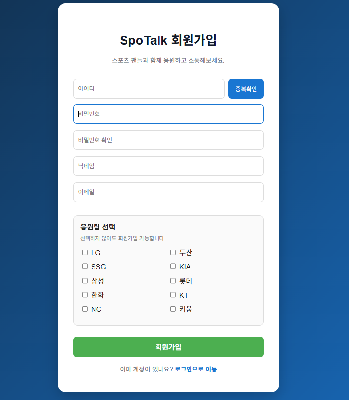
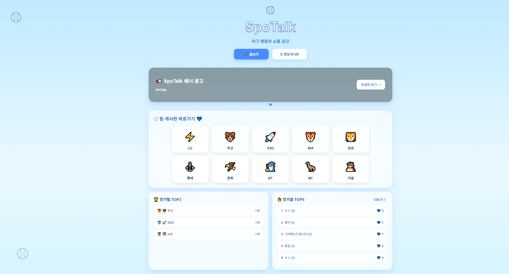
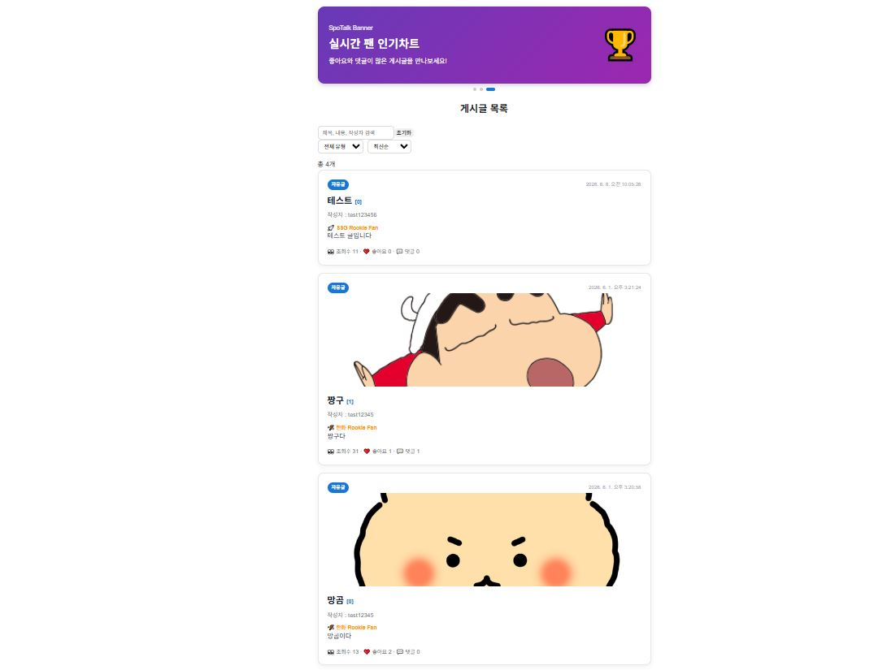
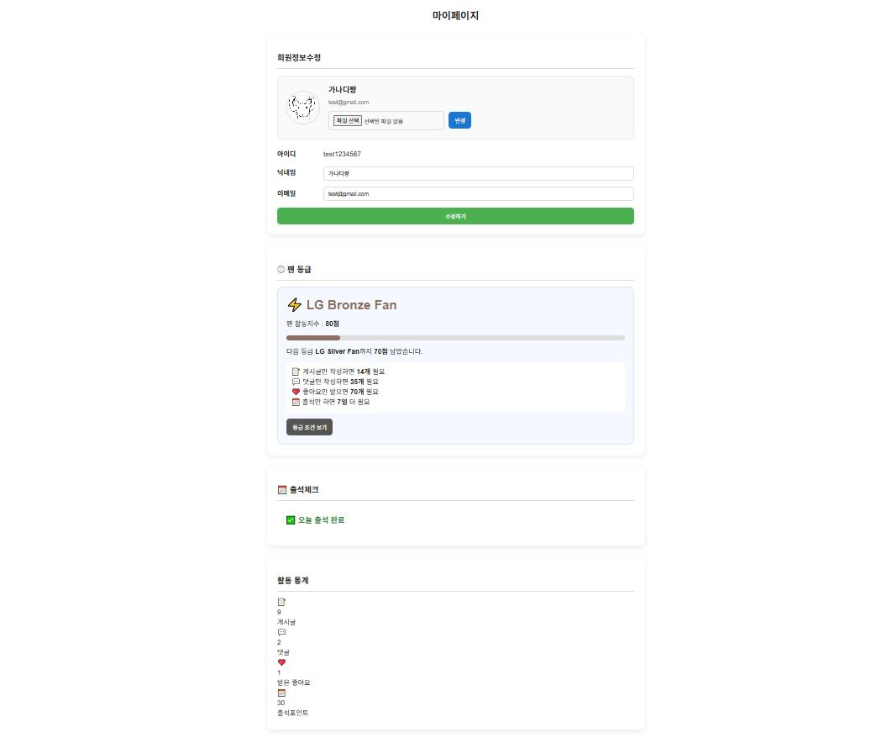
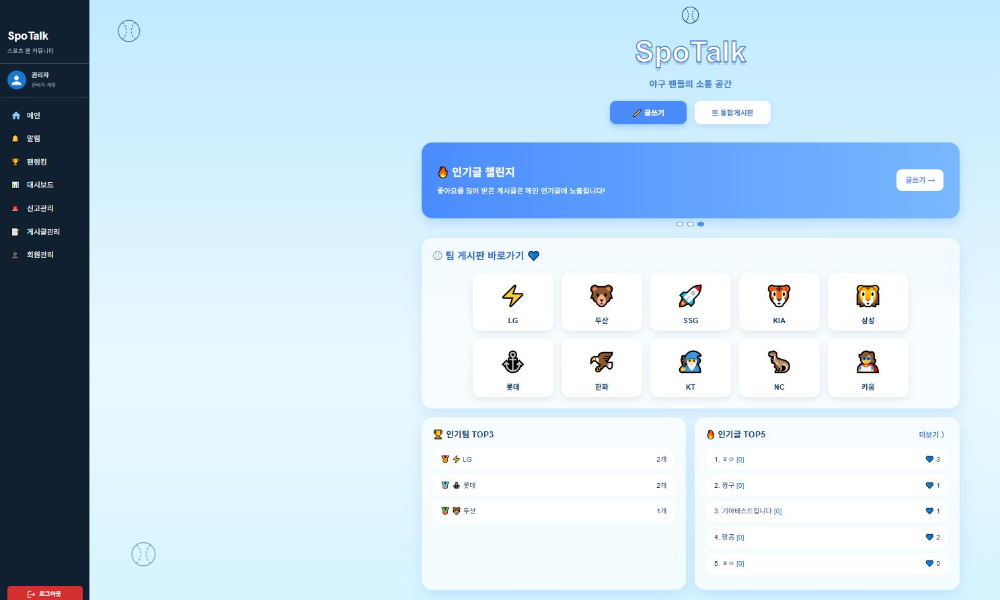

# ⚾ SpoTalk SNS


야구 팬들의 일상을 기록하고 공유하는 스포츠 팬 커뮤니티 SNS
SpoTalk에서 응원팀을 선택하고, 게시글과 댓글, 좋아요, 팔로우를 통해 팬들과 소통해보세요.

---

## 프로젝트소개
-SpoTalk은 스포츠 팬들이 자유롭게 소통할 수 있는 SNS 플랫폼입니다.
-팀별게시판을 활용하여 같은 응원팀을 응원하는 사람과의 정보 공유도 가능하고, 
통합게시판을 통하여 모든 야구팬과의 정보공유등이 가능하고자 만들어진 플랫폼입니다

---
## 개발기간
#### 2026.06.01~2026.06.08(개발 및 설계)
---
## 프로젝트 기획배경

-일반 SNS는 프로야구  팬들을 위한 기능이 부족하여 불편하였습니다. 그러한 불편함을 해소하고자
프로야구 팬 커뮤니티 게시판을 만들게되었습니다

---
## 사용기술

| 구분              | 기술                                               |
| --------------- | ------------------------------------------------ |
| Front-End       | , , ,  |
| Back-End        | , ,                            |
| Database        |                         |
| Version Control | ,                                
---
## 주요기능

## 1.로그인  

## 2.회원가입


## 3.메인페이지

## 4.게시판

## 5.마이페이지

## 6.관리자페이지

---
##  프로젝트 구조

```text
SpoTalk
├── react-front
│   ├── public
│   ├── src
│   │   ├── components
│   │   │   ├── Banner.js
│   │   │   ├── Main.js
│   │   │   ├── Menu.js
│   │   │   └── Sub.js
│   │   ├── pages
│   │   │   ├── Login.js
│   │   │   ├── Join.js
│   │   │   ├── Feed.js
│   │   │   ├── PostView.js
│   │   │   ├── Write.js
│   │   │   ├── MyPage.js
│   │   │   ├── Notification.js
│   │   │   ├── FollowList.js
│   │   │   ├── TeamBoard.js
│   │   │   ├── AdminReport.js
│   │   │   └── AdminPost.js
│   │   ├── App.js
│   │   └── index.js
│   └── package.json
│
├── express-back
│   ├── routes
│   │   ├── user.js
│   │   ├── post.js
│   │   ├── comment.js
│   │   ├── like.js
│   │   ├── follow.js
│   │   ├── notification.js
│   │   ├── report.js
│   │   └── banner.js
│   ├── uploads
│   ├── auth.js
│   ├── db.js
│   ├── app.js
│   └── package.json
│
└── README.md
```
## 추후 보완사항

-소셜로그인 추가
-베너 광고추가
-팔로워 채팅기능 추가
---
## 개발후기
일반 sns기능에 프로야구 팬들을 위한 기능이 많지는 않아 프로야구 팬으로서 안타까운점이 있었는데 이렇게 직접 구현을 해보니 부족한점도 많이 느꼈고 다양한 문제를 해결해 나감으로써 한단계 성장해 나가지않았나 생각한다.포기하지않고 어려움을 해결하고 지속적으로 도전하며 꾸준히 성장하는 개발자가 되고싶다

