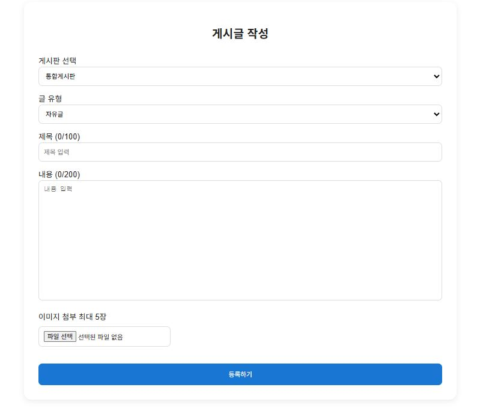
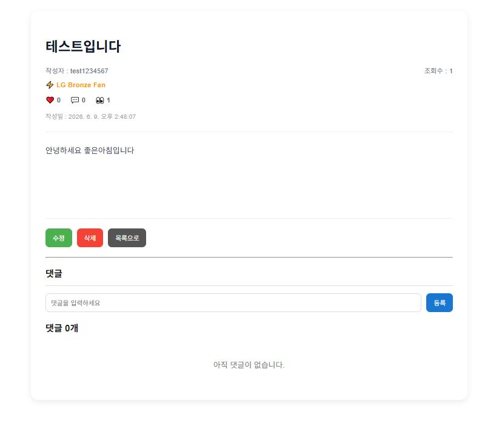

# ⚾ SpoTalk SNS


야구 팬들의 일상을 기록하고 공유하는 스포츠 팬 커뮤니티 SNS  
SpoTalk에서 응원팀을 선택하고, 게시글과 댓글, 좋아요, 팔로우를 통해 팬들과 소통해보세요.

---

## 프로젝트 소개

SpoTalk은 스포츠 팬들이 자유롭게 소통할 수 있는 SNS 플랫폼입니다.  
팀별 게시판을 활용하여 같은 응원팀을 응원하는 사람들과 정보를 공유할 수 있고,  
통합 게시판을 통해 모든 야구팬들과 자유롭게 소통할 수 있도록 만든 플랫폼입니다.

---

## 개발 기간

| 단계          | 기간                      | 내용                                           |
| ----------- | ----------------------- | -------------------------------------------- |
| 설계          | 2026.05.28 ~ 2026.05.29 | 요구사항 분석, 기능 정의, ERD 설계, 화면 설계                |
| 개발          | 2026.06.01 ~ 2026.06.04 | React 프론트엔드 개발, Express API 개발, Oracle DB 구축 |
| 테스트 및 오류 수정 | 2026.06.05 ~ 2026.06.08 | 기능 테스트, API 연동 테스트, 버그 수정 및 최적화              |
| 최종 완료       | 2026.06.08              | 프로젝트 마무리 및 결과물 정리                            |

---

## 프로젝트 기획 배경

일반 SNS는 프로야구 팬들을 위한 기능이 부족하여 불편함이 있었습니다.  
이러한 불편함을 해소하고자 프로야구 팬 커뮤니티 게시판을 만들게 되었습니다.

---

## 사용 기술

| 구분 | 기술 |
| --- | --- |
| Front-End |     |
| Back-End |    |
| Database |  |
| Version Control |   |

---

## 주요 기능

### 1. 로그인


### 2. 회원가입


### 3. 메인페이지


### 4. 게시글작성



### 5. 게시판


### 6. 게시글 상세보기



### 7. 마이페이지


### 8. 관리자페이지


---

## 프로젝트 구조

```text
SpoTalk
├── react-front
│   ├── public
│   ├── src
│   │   ├── components
│   │   │   ├── Banner.js
│   │   │   ├── Main.js
│   │   │   ├── Menu.js
│   │   │   └── Sub.js
│   │   ├── pages
│   │   │   ├── Login.js
│   │   │   ├── Join.js
│   │   │   ├── Feed.js
│   │   │   ├── PostView.js
│   │   │   ├── Write.js
│   │   │   ├── MyPage.js
│   │   │   ├── Notification.js
│   │   │   ├── FollowList.js
│   │   │   ├── TeamBoard.js
│   │   │   ├── AdminReport.js
│   │   │   └── AdminPost.js
│   │   ├── App.js
│   │   └── index.js
│   └── package.json
│
├── express-back
│   ├── routes
│   │   ├── user.js
│   │   ├── post.js
│   │   ├── comment.js
│   │   ├── like.js
│   │   ├── follow.js
│   │   ├── notification.js
│   │   ├── report.js
│   │   └── banner.js
│   ├── uploads
│   ├── auth.js
│   ├── db.js
│   ├── app.js
│   └── package.json
│
└── README.md
```

---

## 추후 보완사항

- 소셜 로그인 기능 추가
- 배너 광고 기능 추가
- 팔로워 간 채팅 기능 추가
- 실시간 알림 기능 고도화
- 모바일 반응형 UI 개선

---

## 개발 후기

일반 SNS 기능에는 프로야구 팬들을 위한 기능이 많지 않아 프로야구 팬으로서 아쉬움이 있었습니다.  
이번 프로젝트를 직접 구현하면서 부족한 점도 많이 느꼈고, 다양한 문제를 해결해 나가며 한 단계 성장할 수 있었습니다.  
앞으로도 포기하지 않고 어려움을 해결하며 꾸준히 성장하는 개발자가 되고 싶습니다.

---
## 기타 산출물

### 설계 자료

[설계 자료 보기](https://drive.google.com/drive/folders/1833zHtJrhzaA-_t1xvrsyr05f6pQd2f-)

### ERD 자료

[ERD 자료 보기](https://drive.google.com/drive/folders/19r_hmycvKkgHvB84-Rd3IK5XLjVROeA2)

### 시연영상

[시연영상 보기](https://drive.google.com/file/d/12S6DszyUspDSk_I1kXHOdDmsJ9j2aGhI/view?usp=drive_link)


---

## 개발자 정보

- 이름: 성기필
- GitHub: https://github.com/SeongGiPil
- E-mail: [rlvf1234@naver.com](mailto:rlvf1234@naver.com)
